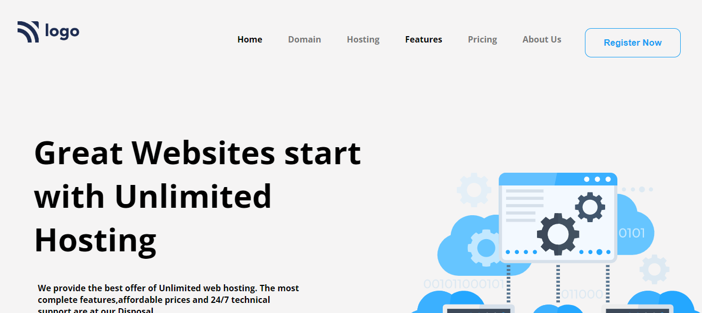
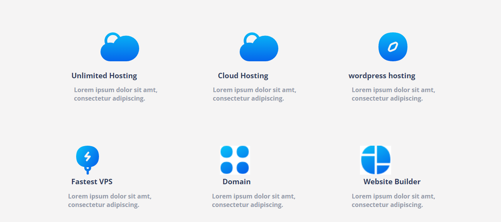
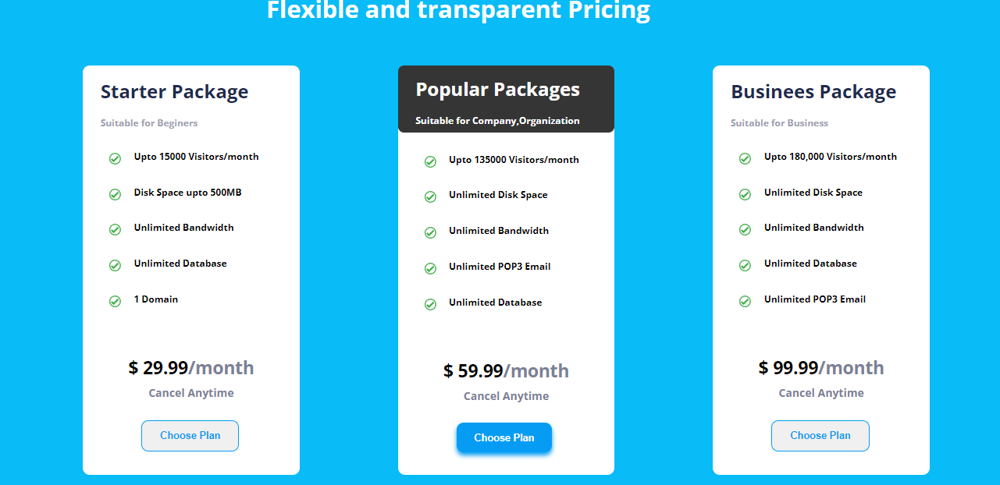
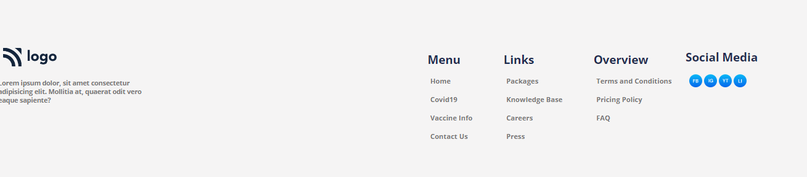

# Project No. 11 (Hosting Page)

This is my _**11th project**_ of Web Development with **Mobile Responsiveness** using Media Queries. The project is designed in such a way that it works on large(Desktop & Laptop) as well as small screens(Mobile Devices). 
> [Check out the Deployed link](https://project-11-bice.vercel.app/)

FULL WEBPAGE:

NAVBAR:

BODY:

FOOTER:

## Technologies Used

## What I leaned

- How to make a full webpage and position elements.
- Working with color and gradients.
- Writing Media Queries.
- How to make a website responsive.
- How to divide the page for image and matter.
- How to make a footer.
- How to style the footer using flex.

# Connect with me

   &ensp;
  &ensp;
  &ensp;
  
